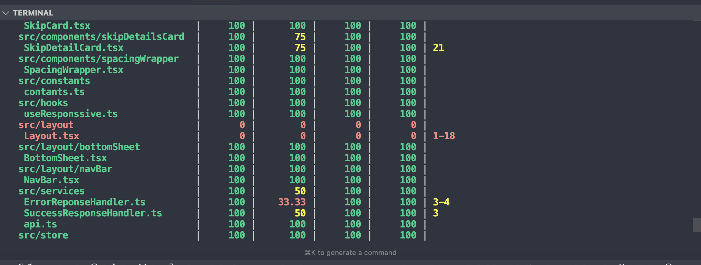
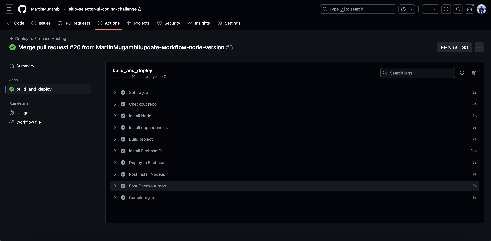

# React Web Project – Skip Selector UI


[LIVE PREVIEW](https://skip-selector-project.web.app/)

---

## 📱 View on Mobile

The UI is fully responsive and optimized for both desktop and mobile devices.

---

## 🚀 Technologies Used

### Frontend

- [React](https://reactjs.org/) – A JavaScript library for building user interfaces
- [TypeScript](https://www.typescriptlang.org/) – A strongly-typed language that builds on JavaScript
- [CSS](https://www.w3schools.com/css/) – Styling the UI with responsive design

### Tooling & Utilities

- [Zustand](https://zustand.docs.pmnd.rs/getting-started/introduction) – Lightweight state management for React
- [Docker](https://www.docker.com/) – Containerization for consistent development environments
- [Jest](https://jestjs.io/) – A JavaScript testing framework
- [GitHub Actions](https://github.com/features/actions) – CI/CD automation for build, test, and deployment

---

## 🎯 Objective

This project aimed to:

- [x] Redesign the page with a fresh, clean layout and improved UI/UX
- [x] Focus on writing clean, maintainable, and scalable React code
- [x] Ensure the design is fully responsive on mobile and desktop

---

## 🧪 Tests



Unit tests are implemented using **Jest** to ensure functionality and reliability.

---

## ⚙️ GitHub Actions (CI/CD)

Automated pipeline for:

- Code build
- Testing
- Deployment to Firebase



---

## 🧰 Getting Started

### 1. Clone the Repository

```bash
git clone https://github.com/MartinMugambi/skip-selector-ui-coding-challenge.git
```
